# Design Document

## Overview

The comprehensive testing plan for DevSync AI will implement a multi-layered testing architecture that validates all system components from individual units to complete end-to-end workflows. The design leverages existing testing infrastructure while extending it with specialized testing modules for environment validation, integration testing, performance benchmarking, and automated reporting.

## Architecture

### Core Testing Framework Architecture

```mermaid
graph TB
    A[Test Orchestrator] --> B[Environment Validator]
    A --> C[Integration Test Suite]
    A --> D[Performance Test Runner]
    A --> E[Security Test Suite]
    A --> F[End-to-End Test Runner]
    
    B --> B1[Environment Variables]
    B --> B2[API Connectivity]
    B --> B3[Database Connection]
    B --> B4[Service Dependencies]
    
    C --> C1[GitHub Integration Tests]
    C --> C2[Slack Integration Tests]
    C --> C3[JIRA Integration Tests]
    C --> C4[Agent Hook Tests]
    
    D --> D1[Load Testing]
    D --> D2[Stress Testing]
    D --> D3[Memory Leak Detection]
    D --> D4[Performance Benchmarking]
    
    E --> E1[Authentication Tests]
    E --> E2[Authorization Tests]
    E --> E3[Data Security Tests]
    E --> E4[Configuration Security]
    
    F --> F1[Daily Workflow Tests]
    F --> F2[Weekly Workflow Tests]
    F --> F3[Error Recovery Tests]
    F --> F4[Edge Case Handling]
    
    A --> G[Test Reporter]
    G --> H[Test Results Database]
    G --> I[HTML Reports]
    G --> J[Performance Dashboards]
```



### Testing Layer Structure

The testing system follows a hierarchical structure with four main layers:

1. **Unit Testing Layer**: Individual component validation
2. **Integration Testing Layer**: Service-to-service communication validation
3. **System Testing Layer**: Complete workflow validation
4. **Acceptance Testing Layer**: End-user scenario validation

## Components and Interfaces

### 1. Test Orchestrator

**Purpose**: Central coordinator for all testing activities

**Key Interfaces**:
```python
class TestOrchestrator:
    async def run_comprehensive_tests(self, config: TestConfig) -> TestResults
    async def run_test_suite(self, suite_name: str) -> SuiteResults
    async def validate_prerequisites(self) -> ValidationResults
    def generate_test_report(self, results: TestResults) -> TestReport
```

**Responsibilities**:
- Coordinate test execution across all modules
- Manage test dependencies and sequencing
- Aggregate results from all test suites
- Generate comprehensive reports

### 2. Environment Validator

**Purpose**: Validate system prerequisites and configuration

**Key Interfaces**:
```python
class EnvironmentValidator:
    async def validate_environment_variables(self) -> ValidationResult
    async def test_api_connectivity(self) -> ConnectivityResult
    async def verify_database_connection(self) -> DatabaseResult
    async def check_service_dependencies(self) -> DependencyResult
```

**Validation Checks**:
- Environment variable presence and format validation
- API token authentication and permissions
- Database connectivity and schema validation
- External service availability and response times

### 3. Integration Test Suite Manager

**Purpose**: Manage and execute integration tests for all external services

**Key Interfaces**:
```python
class IntegrationTestSuite:
    async def test_github_integration(self) -> GitHubTestResults
    async def test_slack_integration(self) -> SlackTestResults
    async def test_jira_integration(self) -> JiraTestResults
    async def test_webhook_processing(self) -> WebhookTestResults
```

**Integration Test Categories**:
- **GitHub Integration**: PR fetching, analysis, webhook processing
- **Slack Integration**: Message formatting, delivery, threading
- **JIRA Integration**: Ticket tracking, status changes, blocker detection
- **Agent Hooks**: Webhook simulation, hook execution, notification delivery

### 4. Performance Test Runner

**Purpose**: Execute performance and load testing scenarios

**Key Interfaces**:
```python
class PerformanceTestRunner:
    async def run_load_test(self, config: LoadTestConfig) -> PerformanceMetrics
    async def execute_stress_test(self, limits: StressTestLimits) -> StressResults
    async def detect_memory_leaks(self, iterations: int) -> MemoryAnalysis
    async def benchmark_components(self) -> BenchmarkResults
```

**Performance Test Types**:
- **Load Testing**: Concurrent request handling, throughput measurement
- **Stress Testing**: System breaking point identification
- **Memory Analysis**: Memory leak detection and resource usage monitoring
- **Response Time Benchmarking**: Component-level performance measurement

### 5. Security Test Suite

**Purpose**: Validate security controls and data protection

**Key Interfaces**:
```python
class SecurityTestSuite:
    async def test_authentication(self) -> AuthTestResults
    async def test_authorization(self) -> AuthzTestResults
    async def validate_data_security(self) -> DataSecurityResults
    async def audit_configuration_security(self) -> ConfigSecurityResults
```

**Security Test Areas**:
- **Authentication**: Token validation, credential handling
- **Authorization**: Permission enforcement, access control
- **Data Security**: Encryption, secure transmission, data sanitization
- **Configuration Security**: Environment variable usage, secret management

### 6. End-to-End Test Runner

**Purpose**: Execute complete workflow scenarios

**Key Interfaces**:
```python
class EndToEndTestRunner:
    async def test_daily_workflow(self) -> WorkflowResults
    async def test_weekly_workflow(self) -> WeeklyResults
    async def test_error_recovery(self) -> RecoveryResults
    async def test_edge_cases(self) -> EdgeCaseResults
```

**Workflow Test Scenarios**:
- **Daily Workflows**: Standup generation, PR notifications, JIRA updates
- **Weekly Workflows**: Changelog generation, team analytics, sprint summaries
- **Error Recovery**: API failures, network issues, data corruption
- **Edge Cases**: Empty data sets, malformed inputs, rate limit scenarios

## Data Models

### Test Configuration Model

```python
@dataclass
class TestConfig:
    environment: str  # 'development', 'staging', 'production'
    test_suites: List[str]  # Which test suites to run
    parallel_execution: bool
    max_concurrent_tests: int
    timeout_seconds: int
    retry_attempts: int
    generate_reports: bool
    save_artifacts: bool
    notification_channels: List[str]
```

### Test Results Model

```python
@dataclass
class TestResults:
    test_id: str
    start_time: datetime
    end_time: datetime
    total_duration: timedelta
    environment_validation: ValidationResults
    integration_results: Dict[str, IntegrationResults]
    performance_results: PerformanceMetrics
    security_results: SecurityResults
    end_to_end_results: WorkflowResults
    overall_success: bool
    success_rate: float
    failed_tests: List[FailedTest]
    warnings: List[Warning]
    recommendations: List[Recommendation]
```

### Performance Metrics Model

```python
@dataclass
class PerformanceMetrics:
    total_requests: int
    successful_requests: int
    failed_requests: int
    success_rate: float
    avg_response_time_ms: float
    p95_response_time_ms: float
    p99_response_time_ms: float
    requests_per_second: float
    memory_usage_mb: float
    cpu_usage_percent: float
    errors: List[str]
    bottlenecks: List[Bottleneck]
```

## Error Handling

### Error Classification System

The testing system implements a comprehensive error classification system:

1. **Critical Errors**: System failures that prevent test execution
2. **Test Failures**: Individual test failures that don't block other tests
3. **Warnings**: Issues that don't cause failures but indicate potential problems
4. **Information**: Diagnostic information for troubleshooting

### Error Recovery Strategies

```python
class ErrorRecoveryManager:
    async def handle_api_failure(self, service: str, error: Exception) -> RecoveryAction
    async def handle_timeout(self, test_name: str, timeout: int) -> RecoveryAction
    async def handle_resource_exhaustion(self, resource: str) -> RecoveryAction
    async def handle_configuration_error(self, config_key: str) -> RecoveryAction
```

**Recovery Actions**:
- **Retry with Backoff**: Exponential backoff for transient failures
- **Fallback Mode**: Use mock services when external services are unavailable
- **Graceful Degradation**: Continue with reduced functionality
- **Test Skipping**: Skip dependent tests when prerequisites fail

## Testing Strategy

### Test Data Management

**Mock Data Generation**:
- Realistic GitHub PR data with various states and complexities
- JIRA ticket data covering all status transitions and edge cases
- Slack message templates for different notification types
- User and team data for permission and assignment testing

**Test Data Isolation**:
- Separate test databases for each test suite
- Cleanup procedures to prevent test data pollution
- Snapshot and restore capabilities for consistent test states

### Test Environment Management

**Environment Configurations**:
```yaml
test_environments:
  unit:
    database: in_memory
    external_services: mocked
    parallel_execution: true
  
  integration:
    database: test_database
    external_services: sandboxed
    parallel_execution: limited
  
  end_to_end:
    database: staging_database
    external_services: production_like
    parallel_execution: false
```

### Continuous Integration Integration

**CI/CD Pipeline Integration**:
- Pre-commit hooks for unit tests
- Pull request validation with integration tests
- Nightly comprehensive test runs
- Performance regression detection
- Automated test result notifications

## Performance Optimization

### Test Execution Optimization

**Parallel Execution Strategy**:
- Independent tests run in parallel
- Dependent tests run in sequence
- Resource-intensive tests run with limited concurrency
- Database tests use separate schemas

**Caching Strategy**:
- Cache test data between runs
- Reuse mock service instances
- Cache API responses for deterministic tests
- Persist performance baselines

### Resource Management

**Memory Management**:
- Monitor memory usage during test execution
- Implement garbage collection between test suites
- Detect and report memory leaks
- Set memory limits for individual tests

**Database Connection Management**:
- Connection pooling for database tests
- Automatic connection cleanup
- Transaction rollback for test isolation
- Connection limit monitoring

## Monitoring and Observability

### Test Execution Monitoring

**Real-time Monitoring**:
- Test execution progress tracking
- Resource usage monitoring
- Error rate tracking
- Performance metric collection

**Alerting System**:
- Critical test failure notifications
- Performance regression alerts
- Resource exhaustion warnings
- Test suite completion notifications

### Metrics Collection

**Test Metrics**:
- Test execution times and trends
- Success/failure rates over time
- Performance benchmark comparisons
- Resource usage patterns

**Business Metrics**:
- Test coverage metrics
- Defect detection rates
- Time to feedback
- Test maintenance overhead

## Reporting and Analytics

### Test Report Generation

**Report Types**:
1. **Executive Summary**: High-level success/failure overview
2. **Detailed Technical Report**: Component-level results and diagnostics
3. **Performance Report**: Benchmarks, trends, and recommendations
4. **Security Report**: Security test results and compliance status

**Report Formats**:
- HTML reports with interactive charts
- JSON reports for programmatic consumption
- PDF reports for stakeholder distribution
- Slack notifications for immediate feedback

### Historical Analysis

**Trend Analysis**:
- Performance trend tracking over time
- Success rate trends by component
- Error pattern analysis
- Resource usage trends

**Regression Detection**:
- Automated performance regression detection
- Test failure pattern analysis
- Quality metric degradation alerts
- Capacity planning recommendations

## Deployment and Maintenance

### Test Infrastructure Deployment

**Infrastructure Requirements**:
- Dedicated test execution environment
- Isolated test databases
- Mock service infrastructure
- Performance monitoring tools

**Deployment Strategy**:
- Infrastructure as Code (IaC) for test environments
- Automated test infrastructure provisioning
- Environment consistency validation
- Disaster recovery procedures

### Maintenance Procedures

**Regular Maintenance Tasks**:
- Test data cleanup and refresh
- Performance baseline updates
- Mock service data updates
- Test environment health checks

**Test Suite Maintenance**:
- Regular test review and updates
- Obsolete test removal
- New feature test addition
- Test documentation updates