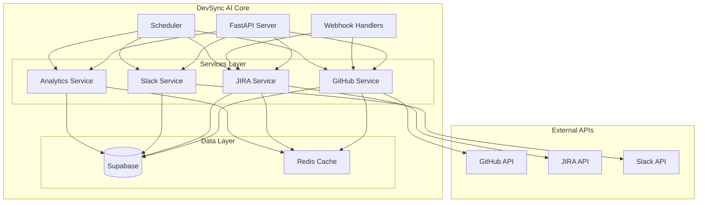

# Design Document

## Overview

DevSync AI is designed as a microservices-based application that orchestrates communication between GitHub, JIRA, and Slack APIs to provide automated release coordination. The system follows an event-driven architecture with scheduled tasks, webhook handlers, and real-time processing capabilities. The core design emphasizes modularity, scalability, and maintainability through clear separation of concerns.

## Architecture

The system follows a layered architecture pattern with the following components:



## Components and Interfaces

### 1. FastAPI Server (`/api`)
- **Purpose**: Main HTTP server providing RESTful endpoints
- **Responsibilities**: Request routing, authentication, response formatting
- **Key Endpoints**:
  - `GET /health` - Health check
  - `GET /github/prs` - Get PR summaries
  - `GET /jira/tickets` - Get ticket status
  - `POST /slack/notify` - Send custom notifications
  - `GET /analytics/bottlenecks` - Get team analytics
  - `GET /changelog/weekly` - Generate weekly changelog

### 2. Webhook Handlers (`/webhooks`)
- **Purpose**: Process real-time events from external services
- **Responsibilities**: Event validation, payload processing, triggering updates
- **Key Handlers**:
  - `POST /webhooks/github` - GitHub PR/commit events
  - `POST /webhooks/jira` - JIRA ticket updates
  - `POST /webhooks/slack` - Slack interaction events

### 3. GitHub Service (`/services/github`)
- **Purpose**: Interface with GitHub API for repository data
- **Key Methods**:
  - `get_open_prs()` - Fetch open pull requests
  - `check_merge_conflicts()` - Detect merge conflicts
  - `get_commit_history()` - Retrieve commit data for changelogs
  - `analyze_pr_activity()` - Track PR review and merge patterns

### 4. JIRA Service (`/services/jira`)
- **Purpose**: Sync with JIRA for project management data
- **Key Methods**:
  - `sync_tickets()` - Update ticket status and progress
  - `detect_blockers()` - Identify stalled or blocked tickets
  - `get_sprint_data()` - Retrieve current sprint information
  - `analyze_velocity()` - Calculate team velocity metrics

### 5. Slack Service (`/services/slack`)
- **Purpose**: Handle Slack communication and notifications
- **Key Methods**:
  - `send_daily_standup()` - Generate and send daily summaries
  - `notify_real_time()` - Send immediate notifications
  - `format_changelog()` - Format and send weekly changelogs
  - `create_thread_updates()` - Manage threaded conversations

### 6. Analytics Service (`/services/analytics`)
- **Purpose**: Process data to identify patterns and bottlenecks
- **Key Methods**:
  - `identify_bottlenecks()` - Analyze workflow bottlenecks
  - `detect_inactivity()` - Flag inactive team members or tasks
  - `find_duplicated_work()` - Identify overlapping efforts
  - `generate_insights()` - Create actionable recommendations

### 7. Scheduler (`/scheduler`)
- **Purpose**: Manage recurring tasks and automated workflows
- **Key Tasks**:
  - Daily standup generation (configurable time)
  - Weekly changelog compilation
  - Periodic data sync from external APIs
  - Cleanup of old data based on retention policies

## Data Models

### Core Entities

```python
class PullRequest:
    id: str
    repository: str
    title: str
    author: str
    status: PRStatus  # open, draft, ready_for_review, merged, closed
    merge_conflicts: bool
    created_at: datetime
    updated_at: datetime
    reviewers: List[str]
    labels: List[str]

class JiraTicket:
    key: str
    summary: str
    status: str
    assignee: str
    priority: str
    story_points: Optional[int]
    sprint: Optional[str]
    blocked: bool
    last_updated: datetime
    time_in_status: timedelta

class SlackMessage:
    channel: str
    message_type: MessageType  # standup, notification, changelog
    content: str
    timestamp: datetime
    thread_ts: Optional[str]

class TeamMember:
    username: str
    github_handle: str
    jira_account: str
    slack_user_id: str
    role: str
    active: bool

class Bottleneck:
    type: BottleneckType  # pr_review, ticket_blocked, inactive_member
    severity: Severity  # low, medium, high, critical
    description: str
    affected_items: List[str]
    detected_at: datetime
    resolved: bool
```

### Database Schema (Supabase)

```sql
-- Pull Requests tracking
CREATE TABLE pull_requests (
    id TEXT PRIMARY KEY,
    repository TEXT NOT NULL,
    title TEXT NOT NULL,
    author TEXT NOT NULL,
    status TEXT NOT NULL,
    merge_conflicts BOOLEAN DEFAULT FALSE,
    created_at TIMESTAMP WITH TIME ZONE,
    updated_at TIMESTAMP WITH TIME ZONE,
    data JSONB -- Full PR data from GitHub API
);

-- JIRA tickets tracking  
CREATE TABLE jira_tickets (
    key TEXT PRIMARY KEY,
    summary TEXT NOT NULL,
    status TEXT NOT NULL,
    assignee TEXT,
    priority TEXT,
    story_points INTEGER,
    sprint TEXT,
    blocked BOOLEAN DEFAULT FALSE,
    last_updated TIMESTAMP WITH TIME ZONE,
    data JSONB -- Full ticket data from JIRA API
);

-- Analytics and insights
CREATE TABLE bottlenecks (
    id UUID PRIMARY KEY DEFAULT gen_random_uuid(),
    type TEXT NOT NULL,
    severity TEXT NOT NULL,
    description TEXT NOT NULL,
    affected_items JSONB,
    detected_at TIMESTAMP WITH TIME ZONE DEFAULT NOW(),
    resolved BOOLEAN DEFAULT FALSE,
    resolved_at TIMESTAMP WITH TIME ZONE
);

-- Message history for audit and analysis
CREATE TABLE slack_messages (
    id UUID PRIMARY KEY DEFAULT gen_random_uuid(),
    channel TEXT NOT NULL,
    message_type TEXT NOT NULL,
    content TEXT NOT NULL,
    sent_at TIMESTAMP WITH TIME ZONE DEFAULT NOW(),
    thread_ts TEXT
);
```

## Error Handling

### API Error Responses
- **400 Bad Request**: Invalid request parameters or payload
- **401 Unauthorized**: Missing or invalid authentication
- **403 Forbidden**: Insufficient permissions for requested operation
- **404 Not Found**: Requested resource does not exist
- **429 Too Many Requests**: Rate limit exceeded
- **500 Internal Server Error**: Unexpected server error
- **502 Bad Gateway**: External API unavailable
- **503 Service Unavailable**: System maintenance or overload

### External API Resilience
- **Retry Logic**: Exponential backoff for transient failures
- **Circuit Breaker**: Prevent cascading failures from external API outages
- **Fallback Mechanisms**: Cached data when real-time data unavailable
- **Rate Limit Handling**: Respect API rate limits with queuing and throttling

### Data Consistency
- **Transaction Management**: Ensure data integrity across operations
- **Conflict Resolution**: Handle concurrent updates to shared resources
- **Audit Logging**: Track all data modifications for debugging and compliance

## Testing Strategy

### Unit Testing
- **Service Layer**: Mock external API calls, test business logic
- **Data Models**: Validate serialization, validation rules
- **Utilities**: Test helper functions and data transformations
- **Coverage Target**: 90% code coverage minimum

### Integration Testing
- **API Endpoints**: Test full request/response cycles
- **Database Operations**: Verify CRUD operations and queries
- **External API Integration**: Test with sandbox/staging environments
- **Webhook Processing**: Validate event handling and processing

### End-to-End Testing
- **Workflow Testing**: Complete user scenarios from trigger to notification
- **Performance Testing**: Load testing for concurrent users and high data volume
- **Security Testing**: Authentication, authorization, and data protection
- **Monitoring Integration**: Verify logging, metrics, and alerting

### Test Data Management
- **Fixtures**: Standardized test data for consistent testing
- **Database Seeding**: Automated test database setup and teardown
- **Mock Services**: Simulate external API responses for reliable testing
- **Environment Isolation**: Separate test environments to prevent interference