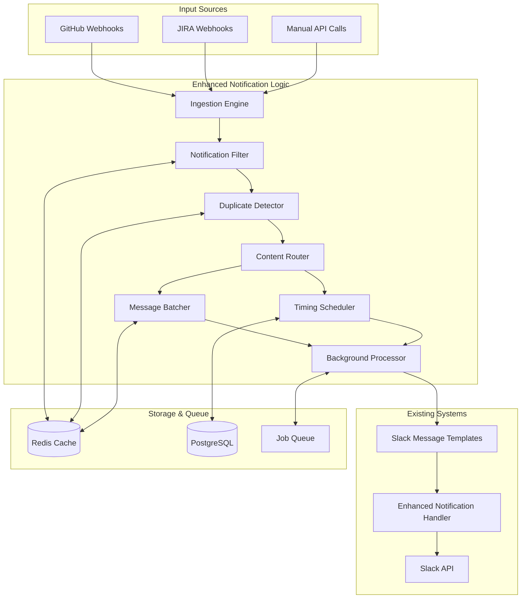

# Design Document

## Overview

The Enhanced Notification Logic system transforms DevSync AI from a simple notification relay into an intelligent notification management platform. The system processes GitHub and JIRA events through a sophisticated pipeline that includes filtering, batching, scheduling, routing, and duplicate prevention before delivering notifications via the existing slack-message-templates system.

The architecture follows a modular, event-driven design that integrates seamlessly with existing components while adding powerful new capabilities for noise reduction, intelligent timing, and context-aware routing.

## Architecture

### High-Level Architecture



### Component Architecture

The system consists of seven core components that work together to process notifications intelligently:

1. **Ingestion Engine**: Receives and normalizes incoming notifications
2. **Notification Filter**: Applies smart filtering rules to reduce noise
3. **Duplicate Detector**: Prevents duplicate notifications using content hashing
4. **Content Router**: Routes notifications to appropriate channels based on content analysis
5. **Message Batcher**: Groups related notifications for consolidated delivery
6. **Timing Scheduler**: Manages work hours and scheduled delivery
7. **Background Processor**: Handles asynchronous processing and job management

## Components and Interfaces

### 1. Ingestion Engine

**Purpose**: Receives, validates, and normalizes incoming notifications from various sources.

**Interface**:
```python
class IngestionEngine:
    def process_github_webhook(self, event_type: str, payload: Dict) -> NotificationEvent
    def process_jira_webhook(self, event_type: str, payload: Dict) -> NotificationEvent
    def process_manual_notification(self, notification: Dict) -> NotificationEvent
    def validate_payload(self, payload: Dict) -> bool
    def normalize_event(self, source: str, event_type: str, payload: Dict) -> NotificationEvent
```

**Key Features**:
- Webhook payload validation and sanitization
- Event normalization across different sources (GitHub, JIRA, manual)
- Rate limiting and abuse prevention
- Structured logging for audit trails

### 2. Notification Filter

**Purpose**: Applies intelligent filtering rules to reduce notification noise and improve relevance.

**Interface**:
```python
class NotificationFilter:
    def should_process(self, event: NotificationEvent, context: FilterContext) -> FilterDecision
    def apply_noise_reduction(self, event: NotificationEvent) -> bool
    def check_user_relevance(self, event: NotificationEvent, user: str) -> RelevanceScore
    def evaluate_urgency(self, event: NotificationEvent) -> UrgencyLevel
    def get_filter_rules(self, team_id: str, channel_id: str) -> List[FilterRule]
```

**Filtering Strategies**:
- **Content-based filtering**: Analyze event content for relevance signals
- **User-based filtering**: Consider user involvement (mentions, assignments, reviews)
- **Pattern-based filtering**: Suppress known noise patterns (bot comments, minor updates)
- **Frequency-based filtering**: Limit notification frequency per user/channel
- **Context-aware filtering**: Consider project context, team structure, and workflow stage
#
## 3. Duplicate Detector

**Purpose**: Prevents duplicate notifications using sophisticated content hashing and similarity detection.

**Interface**:
```python
class DuplicateDetector:
    def generate_content_hash(self, event: NotificationEvent) -> str
    def is_duplicate(self, event: NotificationEvent, time_window: timedelta) -> bool
    def find_similar_events(self, event: NotificationEvent) -> List[NotificationEvent]
    def should_update_original(self, original: NotificationEvent, new: NotificationEvent) -> bool
    def cleanup_expired_hashes(self) -> None
```

**Hashing Strategy**:
- **Content hash**: SHA-256 of normalized event content
- **Similarity hash**: Fuzzy hashing for near-duplicate detection
- **Context hash**: Include relevant context (PR number, issue key, author)
- **Time-windowed deduplication**: Configurable time windows for duplicate detection
- **Update detection**: Distinguish between duplicates and legitimate updates

### 4. Content Router

**Purpose**: Intelligently routes notifications to appropriate channels based on content analysis and team structure.

**Interface**:
```python
class ContentRouter:
    def determine_channels(self, event: NotificationEvent) -> List[ChannelRoute]
    def analyze_content_type(self, event: NotificationEvent) -> ContentType
    def evaluate_urgency(self, event: NotificationEvent) -> UrgencyLevel
    def get_team_channels(self, team_id: str, content_type: ContentType) -> List[str]
    def apply_routing_rules(self, event: NotificationEvent) -> RoutingDecision
```

**Routing Logic**:
- **Content-type routing**: Different channels for PRs, issues, deployments, alerts
- **Urgency-based routing**: Critical alerts to dedicated channels
- **Team-based routing**: Route based on code ownership and team structure
- **Project-based routing**: Channel selection based on repository/project
- **User-specific routing**: Direct messages for personal mentions and assignments

### 5. Message Batcher

**Purpose**: Groups related notifications for consolidated delivery to reduce channel noise.

**Interface**:
```python
class MessageBatcher:
    def should_batch(self, event: NotificationEvent) -> bool
    def find_batchable_events(self, event: NotificationEvent) -> List[NotificationEvent]
    def create_batch(self, events: List[NotificationEvent]) -> NotificationBatch
    def is_batch_ready(self, batch: NotificationBatch) -> bool
    def flush_expired_batches(self) -> List[NotificationBatch]
```

**Batching Strategies**:
- **Time-based batching**: Collect events within configurable time windows
- **Size-based batching**: Send when batch reaches maximum size
- **Similarity-based batching**: Group similar events (same PR, same project)
- **Priority-aware batching**: Immediate delivery for urgent notifications
- **Channel-specific batching**: Different batching rules per channel

### 6. Timing Scheduler

**Purpose**: Manages work hours, time zones, and scheduled delivery of notifications.

**Interface**:
```python
class TimingScheduler:
    def should_deliver_now(self, event: NotificationEvent, recipient: str) -> bool
    def schedule_for_work_hours(self, event: NotificationEvent, recipient: str) -> datetime
    def get_work_hours(self, user_id: str) -> WorkHours
    def handle_timezone_conversion(self, time: datetime, user_timezone: str) -> datetime
    def create_morning_digest(self, user_id: str, events: List[NotificationEvent]) -> DigestNotification
```

**Scheduling Features**:
- **Work hours enforcement**: Queue non-urgent notifications outside work hours
- **Timezone handling**: Per-user timezone configuration and conversion
- **Holiday and PTO awareness**: Respect calendar integrations
- **Morning digests**: Consolidated overnight activity summaries
- **Urgency overrides**: Immediate delivery for critical notifications

### 7. Background Processor

**Purpose**: Handles asynchronous processing, job management, and scheduled delivery.

**Interface**:
```python
class BackgroundProcessor:
    def enqueue_notification(self, event: NotificationEvent, delivery_time: datetime) -> str
    def process_scheduled_notifications(self) -> None
    def handle_failed_jobs(self, job_id: str, error: Exception) -> None
    def get_queue_status(self) -> QueueStatus
    def cleanup_completed_jobs(self) -> None
```

**Processing Features**:
- **Asynchronous job processing**: Non-blocking notification handling
- **Retry mechanisms**: Exponential backoff for failed deliveries
- **Dead letter queues**: Handle permanently failed notifications
- **Job prioritization**: Priority queues for urgent notifications
- **Monitoring and alerting**: Queue health and performance metrics## Da
ta Models

### Core Data Models

```python
@dataclass
class NotificationEvent:
    id: str
    source: str  # 'github', 'jira', 'manual'
    event_type: str  # 'pr_opened', 'issue_updated', etc.
    payload: Dict[str, Any]
    metadata: Dict[str, Any]
    created_at: datetime
    urgency: UrgencyLevel
    content_hash: str
    similarity_hash: str
    
@dataclass
class FilterDecision:
    should_process: bool
    reason: str
    confidence: float
    applied_rules: List[str]
    
@dataclass
class ChannelRoute:
    channel_id: str
    reason: str
    priority: int
    delivery_method: str  # 'immediate', 'batched', 'scheduled'
    
@dataclass
class NotificationBatch:
    id: str
    events: List[NotificationEvent]
    channel_id: str
    created_at: datetime
    scheduled_delivery: datetime
    batch_type: str  # 'time', 'size', 'similarity'
    
@dataclass
class WorkHours:
    user_id: str
    timezone: str
    monday: TimeRange
    tuesday: TimeRange
    wednesday: TimeRange
    thursday: TimeRange
    friday: TimeRange
    saturday: Optional[TimeRange]
    sunday: Optional[TimeRange]
    holidays: List[date]
    
@dataclass
class FilterRule:
    id: str
    name: str
    condition: str  # JSON-based rule condition
    action: str  # 'allow', 'block', 'downgrade'
    priority: int
    team_id: Optional[str]
    channel_id: Optional[str]
    active: bool
```

### Configuration Models

```python
@dataclass
class NotificationConfig:
    team_id: str
    filtering_enabled: bool
    batching_enabled: bool
    work_hours_enabled: bool
    duplicate_prevention_enabled: bool
    default_batch_window: timedelta
    max_batch_size: int
    urgency_threshold: UrgencyLevel
    
@dataclass
class ChannelConfig:
    channel_id: str
    team_id: str
    content_types: List[str]
    batching_rules: BatchingConfig
    routing_priority: int
    work_hours_override: Optional[WorkHours]
    
@dataclass
class RoutingRule:
    id: str
    name: str
    condition: Dict[str, Any]  # JSON-based routing condition
    target_channels: List[str]
    priority: int
    active: bool
```

## Error Handling

### Error Categories and Strategies

1. **Input Validation Errors**
   - Invalid webhook payloads
   - Missing required fields
   - Malformed JSON data
   - **Strategy**: Validate early, log errors, return structured error responses

2. **Processing Errors**
   - Filter rule evaluation failures
   - Routing logic errors
   - Batching algorithm failures
   - **Strategy**: Graceful degradation, fallback to simple processing, detailed logging

3. **External Service Errors**
   - Slack API failures
   - Database connection issues
   - Redis cache unavailability
   - **Strategy**: Retry with exponential backoff, circuit breaker pattern, fallback mechanisms

4. **Background Job Errors**
   - Scheduled delivery failures
   - Queue processing errors
   - Job timeout issues
   - **Strategy**: Dead letter queues, manual retry capabilities, alerting

### Error Recovery Mechanisms

```python
class ErrorHandler:
    def handle_validation_error(self, error: ValidationError) -> ErrorResponse
    def handle_processing_error(self, error: ProcessingError, event: NotificationEvent) -> None
    def handle_external_service_error(self, error: ExternalServiceError) -> bool
    def handle_background_job_error(self, job_id: str, error: Exception) -> None
    def should_retry(self, error: Exception, attempt: int) -> bool
    def get_fallback_behavior(self, error_type: str) -> FallbackBehavior
```##
 Testing Strategy

### Unit Testing
- **Component isolation**: Test each component independently with mocked dependencies
- **Rule engine testing**: Comprehensive test coverage for filtering and routing rules
- **Edge case handling**: Test boundary conditions and error scenarios
- **Performance testing**: Validate processing speed and memory usage

### Integration Testing
- **End-to-end workflows**: Test complete notification processing pipelines
- **External service integration**: Test Slack API, database, and cache interactions
- **Background job processing**: Test asynchronous job handling and scheduling
- **Configuration management**: Test dynamic configuration updates

### Performance Testing
- **Load testing**: Simulate high-volume notification processing
- **Stress testing**: Test system behavior under extreme load
- **Memory profiling**: Ensure efficient memory usage for large batches
- **Latency testing**: Validate sub-second response times for urgent notifications

### User Acceptance Testing
- **Filtering effectiveness**: Measure noise reduction and relevance improvement
- **Batching satisfaction**: Evaluate user satisfaction with consolidated notifications
- **Timing accuracy**: Verify work hours and scheduling functionality
- **Channel routing accuracy**: Validate notifications reach appropriate channels

## Security Considerations

### Data Protection
- **Webhook validation**: Verify webhook signatures and sources
- **Payload sanitization**: Clean and validate all input data
- **Sensitive data handling**: Secure processing of user mentions and private information
- **Audit logging**: Comprehensive logging for security monitoring

### Access Control
- **Team-based permissions**: Restrict configuration access to team administrators
- **Channel permissions**: Respect Slack channel membership and permissions
- **API authentication**: Secure API endpoints with proper authentication
- **Configuration validation**: Prevent malicious configuration changes

### Privacy Compliance
- **Data retention**: Configurable retention periods for notification data
- **User consent**: Respect user preferences for notification processing
- **Data anonymization**: Remove or hash sensitive information in logs
- **GDPR compliance**: Support data export and deletion requests

## Performance Optimization

### Caching Strategy
- **Filter rule caching**: Cache compiled filter rules in Redis
- **User preference caching**: Cache work hours and routing preferences
- **Duplicate detection caching**: Efficient hash storage with TTL
- **Channel configuration caching**: Cache routing and batching configurations

### Database Optimization
- **Indexing strategy**: Optimize database queries with appropriate indexes
- **Connection pooling**: Efficient database connection management
- **Query optimization**: Minimize database queries through batching and caching
- **Archival strategy**: Archive old notification data to maintain performance

### Background Processing Optimization
- **Queue partitioning**: Separate queues for different priority levels
- **Worker scaling**: Auto-scaling background workers based on queue depth
- **Batch processing**: Process multiple jobs together when possible
- **Resource monitoring**: Monitor CPU, memory, and I/O usage

## Monitoring and Observability

### Metrics Collection
- **Processing metrics**: Notification volume, processing time, success rates
- **Filtering metrics**: Filter effectiveness, noise reduction percentages
- **Batching metrics**: Batch sizes, consolidation ratios, delivery timing
- **Error metrics**: Error rates, retry counts, failure categories

### Alerting Strategy
- **System health alerts**: Queue depth, processing delays, error rates
- **Performance alerts**: Response time degradation, resource exhaustion
- **Business logic alerts**: Unusual filtering patterns, routing failures
- **External service alerts**: Slack API failures, database connectivity issues

### Logging Strategy
- **Structured logging**: JSON-formatted logs with consistent fields
- **Correlation IDs**: Track notifications through the entire pipeline
- **Performance logging**: Log processing times and resource usage
- **Audit logging**: Log all configuration changes and administrative actions