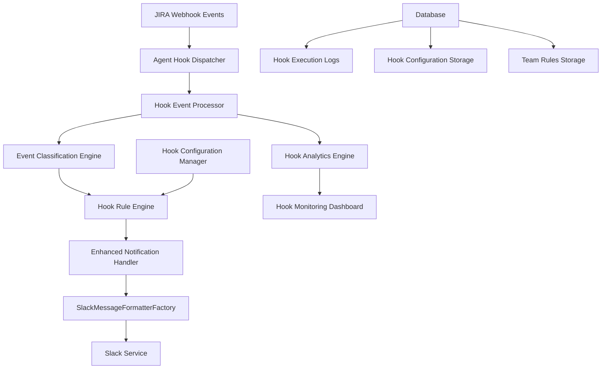

# Design Document

## Overview

The JIRA to Slack Agent Hooks feature creates an intelligent, event-driven automation system that responds to JIRA webhook events and triggers contextual Slack notifications. This system leverages Kiro's Agent Hook capabilities to provide sophisticated event processing, intelligent routing, and seamless integration with the existing enhanced notification system and JIRA service.

The design builds upon the existing infrastructure including the SlackMessageFormatterFactory, enhanced notification handler, JIRA service integration, and webhook processing system to create a comprehensive automation solution.

## Architecture

### High-Level Architecture



### Component Integration

The system integrates with existing components:

- **JIRA Service** (`devsync_ai/services/jira.py`): Provides JIRA API integration and ticket processing
- **Enhanced Notification Handler** (`devsync_ai/core/enhanced_notification_handler.py`): Handles notification routing, batching, and scheduling
- **Slack Service** (`devsync_ai/services/slack.py`): Manages Slack API communication
- **Webhook Routes** (`devsync_ai/webhooks/routes.py`): Processes incoming webhook events
- **Template System**: Uses existing template factories for message formatting

## Components and Interfaces

### 1. Agent Hook Dispatcher

**Purpose**: Central dispatcher that receives JIRA webhook events and routes them to appropriate Agent Hooks.

**Key Interfaces**:
```python
class AgentHookDispatcher:
    async def dispatch_webhook_event(self, webhook_data: Dict[str, Any]) -> HookDispatchResult
    async def register_hook(self, hook: AgentHook) -> bool
    async def unregister_hook(self, hook_id: str) -> bool
    async def get_active_hooks(self) -> List[AgentHook]
```

**Integration Points**:
- Extends existing webhook processing in `devsync_ai/webhooks/routes.py`
- Uses JIRA service for event validation and enrichment
- Connects to Hook Configuration Manager for rule retrieval

### 2. Hook Event Processor

**Purpose**: Processes individual JIRA events and prepares them for hook execution.

**Key Interfaces**:
```python
class HookEventProcessor:
    async def process_jira_event(self, event_type: str, payload: Dict[str, Any]) -> ProcessedEvent
    async def enrich_event_data(self, event: ProcessedEvent) -> EnrichedEvent
    async def validate_event_structure(self, payload: Dict[str, Any]) -> ValidationResult
```

**Event Types Supported**:
- `jira:issue_updated` - Status changes, field updates
- `jira:issue_assigned` - Assignment changes
- `jira:issue_commented` - New comments added
- `jira:issue_priority_changed` - Priority updates
- `jira:issue_created` - New ticket creation
- `jira:issue_transitioned` - Workflow transitions

### 3. Event Classification Engine

**Purpose**: Analyzes JIRA events to determine their significance and routing requirements.

**Key Interfaces**:
```python
class EventClassificationEngine:
    async def classify_event(self, event: ProcessedEvent) -> EventClassification
    async def determine_urgency(self, event: ProcessedEvent) -> UrgencyLevel
    async def extract_stakeholders(self, event: ProcessedEvent) -> List[Stakeholder]
```

**Classification Categories**:
- **Blocker Events**: Status changes to blocked, impediment states
- **Critical Priority**: High/Critical priority ticket changes
- **Assignment Events**: Ticket assignments and reassignments
- **Status Transitions**: Workflow state changes
- **Comment Events**: Comments on high-priority or blocked tickets

### 4. Hook Rule Engine

**Purpose**: Applies team-specific rules and conditions to determine if hooks should execute.

**Key Interfaces**:
```python
class HookRuleEngine:
    async def evaluate_rules(self, event: EventClassification, team_id: str) -> RuleEvaluationResult
    async def load_team_rules(self, team_id: str) -> TeamRuleSet
    async def validate_rule_syntax(self, rules: Dict[str, Any]) -> ValidationResult
```

**Rule Types**:
- **Event Filters**: Include/exclude specific event types
- **Condition Matchers**: Field value conditions (priority, status, assignee)
- **Time-based Rules**: Work hours, frequency limits
- **Stakeholder Rules**: Team member and role-based routing

### 5. Agent Hook Types

**Purpose**: Specialized hook implementations for different JIRA event scenarios.

#### StatusChangeHook
```python
class StatusChangeHook(AgentHook):
    async def execute(self, event: EnrichedEvent) -> HookExecutionResult
    async def format_status_change_message(self, event: EnrichedEvent) -> SlackMessage
    async def determine_notification_urgency(self, old_status: str, new_status: str) -> UrgencyLevel
```

#### AssignmentHook
```python
class AssignmentHook(AgentHook):
    async def execute(self, event: EnrichedEvent) -> HookExecutionResult
    async def analyze_workload_impact(self, assignee: str, team_id: str) -> WorkloadAnalysis
    async def format_assignment_message(self, event: EnrichedEvent) -> SlackMessage
```

#### CommentHook
```python
class CommentHook(AgentHook):
    async def execute(self, event: EnrichedEvent) -> HookExecutionResult
    async def analyze_comment_significance(self, comment: str, ticket_priority: str) -> SignificanceLevel
    async def format_comment_message(self, event: EnrichedEvent) -> SlackMessage
```

#### BlockerHook
```python
class BlockerHook(AgentHook):
    async def execute(self, event: EnrichedEvent) -> HookExecutionResult
    async def detect_blocker_patterns(self, event: EnrichedEvent) -> List[BlockerPattern]
    async def format_blocker_alert(self, event: EnrichedEvent) -> SlackMessage
```

### 6. Hook Configuration Manager

**Purpose**: Manages hook configurations, team rules, and runtime settings.

**Key Interfaces**:
```python
class HookConfigurationManager:
    async def load_team_configuration(self, team_id: str) -> TeamConfiguration
    async def update_team_rules(self, team_id: str, rules: Dict[str, Any]) -> bool
    async def get_hook_settings(self, hook_type: str, team_id: str) -> HookSettings
    async def validate_configuration(self, config: Dict[str, Any]) -> ValidationResult
```

**Configuration Structure**:
```yaml
team_configurations:
  default:
    hooks:
      status_change:
        enabled: true
        channels: ["#dev-updates"]
        conditions:
          - field: "priority"
            operator: "in"
            values: ["High", "Critical"]
        urgency_mapping:
          "To Do -> In Progress": "low"
          "In Progress -> Blocked": "high"
      
      assignment:
        enabled: true
        channels: ["#team-assignments"]
        workload_warnings: true
        max_tickets_per_assignee: 5
      
      comment:
        enabled: true
        channels: ["#ticket-discussions"]
        conditions:
          - field: "ticket_priority"
            operator: "in"
            values: ["High", "Critical"]
```

### 7. Hook Analytics Engine

**Purpose**: Tracks hook performance, execution metrics, and system health.

**Key Interfaces**:
```python
class HookAnalyticsEngine:
    async def record_hook_execution(self, execution_result: HookExecutionResult) -> bool
    async def generate_performance_metrics(self, time_range: TimeRange) -> PerformanceMetrics
    async def detect_performance_issues(self) -> List[PerformanceIssue]
    async def get_hook_health_status(self) -> HealthStatus
```

**Metrics Tracked**:
- Hook execution frequency and success rates
- Processing latency and performance trends
- Error rates and failure patterns
- Notification delivery success rates
- Team engagement metrics

## Data Models

### Core Event Models

```python
@dataclass
class ProcessedEvent:
    event_id: str
    event_type: str
    timestamp: datetime
    jira_event_data: Dict[str, Any]
    ticket_key: str
    project_key: str
    raw_payload: Dict[str, Any]

@dataclass
class EnrichedEvent(ProcessedEvent):
    ticket_details: JiraTicket
    stakeholders: List[Stakeholder]
    classification: EventClassification
    context_data: Dict[str, Any]

@dataclass
class EventClassification:
    category: EventCategory
    urgency: UrgencyLevel
    significance: SignificanceLevel
    affected_teams: List[str]
    routing_hints: Dict[str, Any]

@dataclass
class HookExecutionResult:
    hook_id: str
    execution_id: str
    success: bool
    execution_time_ms: float
    notification_sent: bool
    notification_result: Optional[ProcessingResult]
    errors: List[str]
    metadata: Dict[str, Any]
```

### Configuration Models

```python
@dataclass
class TeamConfiguration:
    team_id: str
    enabled_hooks: List[str]
    default_channels: Dict[str, str]
    notification_preferences: NotificationPreferences
    custom_rules: Dict[str, Any]
    escalation_rules: List[EscalationRule]

@dataclass
class HookSettings:
    hook_type: str
    enabled: bool
    execution_conditions: List[Condition]
    notification_channels: List[str]
    rate_limits: RateLimitConfig
    retry_policy: RetryPolicy
```

## Error Handling

### Error Categories

1. **Webhook Processing Errors**
   - Malformed payload handling
   - Authentication failures
   - Rate limiting responses

2. **Hook Execution Errors**
   - Rule evaluation failures
   - Template rendering errors
   - Notification delivery failures

3. **Configuration Errors**
   - Invalid rule syntax
   - Missing team configurations
   - Channel access issues

### Error Handling Strategy

```python
class HookErrorHandler:
    async def handle_webhook_error(self, error: WebhookError) -> ErrorResponse
    async def handle_execution_error(self, error: ExecutionError) -> RetryDecision
    async def handle_configuration_error(self, error: ConfigError) -> FallbackAction
    
    async def log_error_for_analysis(self, error: Any, context: Dict[str, Any]) -> bool
    async def trigger_error_notifications(self, error: CriticalError) -> bool
```

### Retry and Fallback Mechanisms

- **Exponential Backoff**: For transient failures
- **Circuit Breaker**: For persistent service failures
- **Fallback Templates**: When custom templates fail
- **Default Channels**: When configured channels are unavailable
- **Error Notifications**: Alert administrators of critical failures

## Testing Strategy

### Unit Testing

1. **Hook Logic Testing**
   - Event classification accuracy
   - Rule evaluation correctness
   - Message formatting validation

2. **Integration Testing**
   - JIRA webhook processing
   - Slack notification delivery
   - Database operations

3. **Configuration Testing**
   - Rule syntax validation
   - Team configuration loading
   - Error handling scenarios

### Performance Testing

1. **Load Testing**
   - High-volume webhook processing
   - Concurrent hook executions
   - Database performance under load

2. **Latency Testing**
   - End-to-end processing time
   - Hook execution performance
   - Notification delivery speed

### End-to-End Testing

1. **Webhook Simulation**
   - Mock JIRA webhook events
   - Verify complete processing pipeline
   - Validate Slack message delivery

2. **Team Workflow Testing**
   - Multi-team configuration scenarios
   - Complex rule evaluation
   - Error recovery testing

## Security Considerations

### Authentication and Authorization

- **Webhook Signature Verification**: Validate JIRA webhook signatures
- **Team Access Control**: Ensure hooks only access authorized team data
- **Channel Permissions**: Verify Slack channel access rights
- **Configuration Security**: Protect sensitive team configurations

### Data Privacy

- **PII Handling**: Sanitize personal information in notifications
- **Data Retention**: Implement retention policies for hook execution logs
- **Audit Logging**: Track configuration changes and access patterns

### Rate Limiting and Abuse Prevention

- **Hook Execution Limits**: Prevent excessive hook executions
- **Notification Rate Limiting**: Avoid Slack API rate limits
- **Resource Protection**: Prevent resource exhaustion attacks

## Monitoring and Observability

### Metrics Collection

```python
class HookMetricsCollector:
    async def record_execution_metrics(self, result: HookExecutionResult) -> None
    async def record_performance_metrics(self, latency: float, success: bool) -> None
    async def record_error_metrics(self, error_type: str, context: Dict[str, Any]) -> None
```

### Health Checks

- **Hook System Health**: Overall system status
- **Individual Hook Health**: Per-hook performance metrics
- **Integration Health**: External service connectivity
- **Configuration Health**: Rule and configuration validity

### Alerting

- **Performance Degradation**: Slow hook execution times
- **High Error Rates**: Excessive failures
- **Configuration Issues**: Invalid or missing configurations
- **Service Dependencies**: JIRA or Slack service issues

## Deployment and Configuration

### Environment Configuration

```yaml
jira_hooks:
  enabled: true
  webhook_secret: "${JIRA_WEBHOOK_SECRET}"
  default_team_id: "default"
  max_concurrent_executions: 10
  execution_timeout_seconds: 30
  
  analytics:
    enabled: true
    retention_days: 90
    performance_monitoring: true
  
  error_handling:
    max_retries: 3
    retry_delay_seconds: 5
    circuit_breaker_threshold: 10
```

### Database Schema Extensions

```sql
-- Hook execution logs
CREATE TABLE hook_executions (
    id UUID PRIMARY KEY DEFAULT gen_random_uuid(),
    hook_id VARCHAR(255) NOT NULL,
    execution_id VARCHAR(255) NOT NULL,
    event_type VARCHAR(100) NOT NULL,
    team_id VARCHAR(100) NOT NULL,
    ticket_key VARCHAR(50),
    success BOOLEAN NOT NULL,
    execution_time_ms INTEGER NOT NULL,
    notification_sent BOOLEAN DEFAULT FALSE,
    error_message TEXT,
    created_at TIMESTAMP DEFAULT NOW(),
    metadata JSONB
);

-- Team hook configurations
CREATE TABLE team_hook_configurations (
    id UUID PRIMARY KEY DEFAULT gen_random_uuid(),
    team_id VARCHAR(100) NOT NULL,
    hook_type VARCHAR(100) NOT NULL,
    configuration JSONB NOT NULL,
    enabled BOOLEAN DEFAULT TRUE,
    created_at TIMESTAMP DEFAULT NOW(),
    updated_at TIMESTAMP DEFAULT NOW(),
    UNIQUE(team_id, hook_type)
);

-- Hook performance metrics
CREATE TABLE hook_performance_metrics (
    id UUID PRIMARY KEY DEFAULT gen_random_uuid(),
    hook_type VARCHAR(100) NOT NULL,
    team_id VARCHAR(100) NOT NULL,
    metric_name VARCHAR(100) NOT NULL,
    metric_value DECIMAL NOT NULL,
    recorded_at TIMESTAMP DEFAULT NOW(),
    metadata JSONB
);
```

This design provides a comprehensive, scalable, and maintainable solution for JIRA to Slack Agent Hooks that integrates seamlessly with the existing DevSync AI infrastructure while providing advanced automation capabilities.