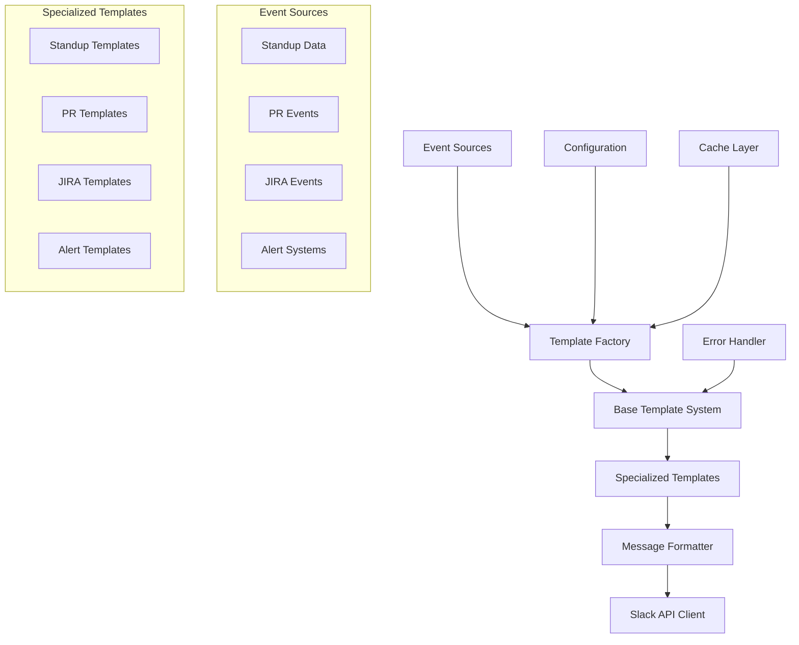
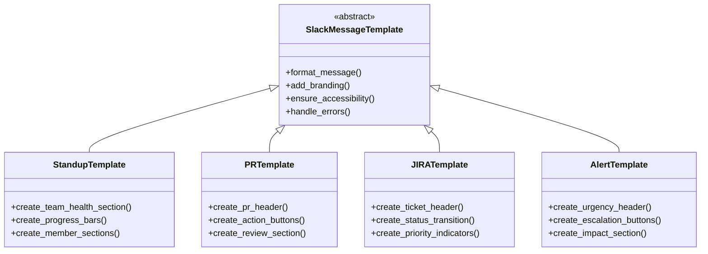

# Design Document

## Overview

The Slack Message Templates system is designed as a modular, extensible notification framework that transforms development workflow events into rich, interactive Slack messages. The system uses a template-based architecture with inheritance patterns, caching mechanisms, and configuration-driven customization to deliver consistent, accessible, and engaging notifications.

## Architecture

### High-Level Architecture



### Template Inheritance Hierarchy



## Components and Interfaces

### 1. Base Template System

**SlackMessageTemplate (Abstract Base Class)**
- Provides common formatting utilities
- Implements accessibility features (alt text, fallbacks)
- Handles error scenarios with graceful degradation
- Manages consistent branding and styling
- Implements caching mechanisms for performance

**Key Methods:**
```python
class SlackMessageTemplate(ABC):
    @abstractmethod
    def format_message(self, data: Dict) -> Dict
    
    def add_branding(self, blocks: List) -> List
    def ensure_accessibility(self, blocks: List) -> List
    def handle_missing_data(self, data: Dict, required_fields: List) -> Dict
    def create_fallback_text(self, blocks: List) -> str
```

### 2. Template Factory

**MessageTemplateFactory**
- Manages template instantiation and caching
- Handles template selection based on event type
- Implements A/B testing capabilities
- Provides performance monitoring and metrics
- Manages template versioning and rollbacks

**Key Methods:**
```python
class MessageTemplateFactory:
    def create_template(self, template_type: str, config: Dict) -> SlackMessageTemplate
    def get_cached_template(self, cache_key: str) -> Optional[SlackMessageTemplate]
    def register_template(self, name: str, template_class: Type)
    def get_template_metrics(self, template_type: str) -> Dict
```

### 3. Specialized Template Classes

**StandupTemplate**
- Team health visualization with color coding
- Sprint progress bars with completion percentages
- Individual member sections (yesterday/today/blockers)
- Action items tracking with assignees
- Interactive dashboard buttons

**PRTemplate Variants**
- NewPRTemplate: Highlights new PR creation
- ReadyForReviewTemplate: Emphasizes review readiness
- ApprovedPRTemplate: Shows merge readiness
- ConflictsTemplate: Warning styling with guidance
- MergedPRTemplate: Success celebration
- ClosedPRTemplate: Closure notification

**JIRATemplate Variants**
- StatusChangeTemplate: Visual status transitions
- PriorityChangeTemplate: Priority escalation indicators
- AssignmentTemplate: Assignment notifications
- CommentTemplate: Comment display with context
- BlockerTemplate: Blocker identification and escalation
- SprintChangeTemplate: Sprint transition context

**AlertTemplate Variants**
- BuildFailureTemplate: CI/CD failure alerts
- DeploymentIssueTemplate: Deployment problem notifications
- SecurityVulnerabilityTemplate: CVE alerts
- ServiceOutageTemplate: Service disruption alerts
- CriticalBugTemplate: Data integrity issues
- TeamBlockerTemplate: Productivity blockers

## Data Models

### Core Data Structures

```python
@dataclass
class SlackMessage:
    blocks: List[Dict]
    text: str  # Fallback text
    thread_ts: Optional[str]
    channel: str
    metadata: Dict

@dataclass
class TemplateConfig:
    team_id: str
    branding: Dict
    emoji_set: Dict
    color_scheme: Dict
    interactive_elements: bool
    accessibility_mode: bool

@dataclass
class EventData:
    event_type: str
    timestamp: datetime
    source: str
    payload: Dict
    priority: str
    metadata: Dict
```

### Template-Specific Data Models

```python
@dataclass
class StandupData:
    date: str
    team: str
    stats: Dict[str, int]
    team_members: List[Dict]
    action_items: List[Dict]
    sprint_progress: Dict

@dataclass
class PRData:
    pr: Dict  # PR details
    action: str  # opened, approved, merged, etc.
    reviewers: List[str]
    checks: Dict
    conflicts: Optional[List]

@dataclass
class JIRAData:
    ticket: Dict
    change_type: str
    previous_state: Optional[Dict]
    assignee_changes: Optional[Dict]
    comments: Optional[List]

@dataclass
class AlertData:
    alert: Dict
    severity: str
    affected_systems: List[str]
    impact: str
    escalation_path: List[str]
```

## Error Handling

### Error Handling Strategy

1. **Graceful Degradation**: When rich formatting fails, fall back to plain text
2. **Missing Data Handling**: Use placeholder content for missing required fields
3. **Template Fallbacks**: If specialized template fails, use base template
4. **Retry Mechanisms**: Implement exponential backoff for API failures
5. **Error Logging**: Comprehensive logging for debugging and monitoring

### Error Scenarios

```python
class TemplateError(Exception):
    """Base exception for template errors"""
    pass

class DataValidationError(TemplateError):
    """Raised when input data is invalid"""
    pass

class FormattingError(TemplateError):
    """Raised when message formatting fails"""
    pass

class SlackAPIError(TemplateError):
    """Raised when Slack API calls fail"""
    pass
```

## Testing Strategy

### Unit Testing
- Test each template class independently
- Mock external dependencies (Slack API, data sources)
- Test error handling scenarios
- Validate accessibility features
- Test data validation logic

### Integration Testing
- Test template factory with real configurations
- Test end-to-end message creation and formatting
- Test caching mechanisms
- Test performance under load
- Test with various data scenarios

### Accessibility Testing
- Validate fallback text generation
- Test screen reader compatibility
- Verify color contrast requirements
- Test keyboard navigation for interactive elements

### Performance Testing
- Benchmark template rendering times
- Test caching effectiveness
- Load test with high message volumes
- Memory usage profiling
- API rate limit handling

### Test Data Generation
- Comprehensive test data generators for all template types
- Edge case scenarios (missing data, malformed input)
- Large dataset testing for performance validation
- A/B testing scenario generation

## Configuration and Customization

### Team-Specific Configuration

```yaml
# config/template_config.yaml
teams:
  engineering:
    branding:
      primary_color: "#1f77b4"
      logo_emoji: ":gear:"
      team_name: "Engineering Team"
    emoji_set:
      success: ":white_check_mark:"
      warning: ":warning:"
      error: ":x:"
    features:
      interactive_buttons: true
      threading: true
      batching: true
```

### Template Customization Points
- Color schemes and branding
- Emoji sets and visual indicators
- Interactive element preferences
- Message threading behavior
- Batching and timing controls
- Accessibility options

## Performance Considerations

### Caching Strategy
- Template instance caching with TTL
- Rendered message caching for repeated content
- Configuration caching to reduce file I/O
- Slack API response caching where appropriate

### Optimization Techniques
- Lazy loading of template classes
- Batch processing for multiple notifications
- Asynchronous message sending
- Connection pooling for Slack API
- Memory-efficient data structures

### Monitoring and Metrics
- Template rendering performance metrics
- Message delivery success rates
- Cache hit/miss ratios
- Error rates by template type
- User engagement metrics (button clicks, thread responses)