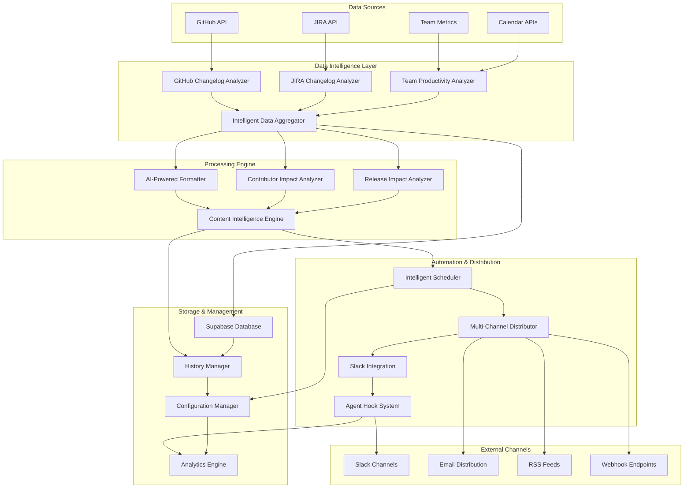
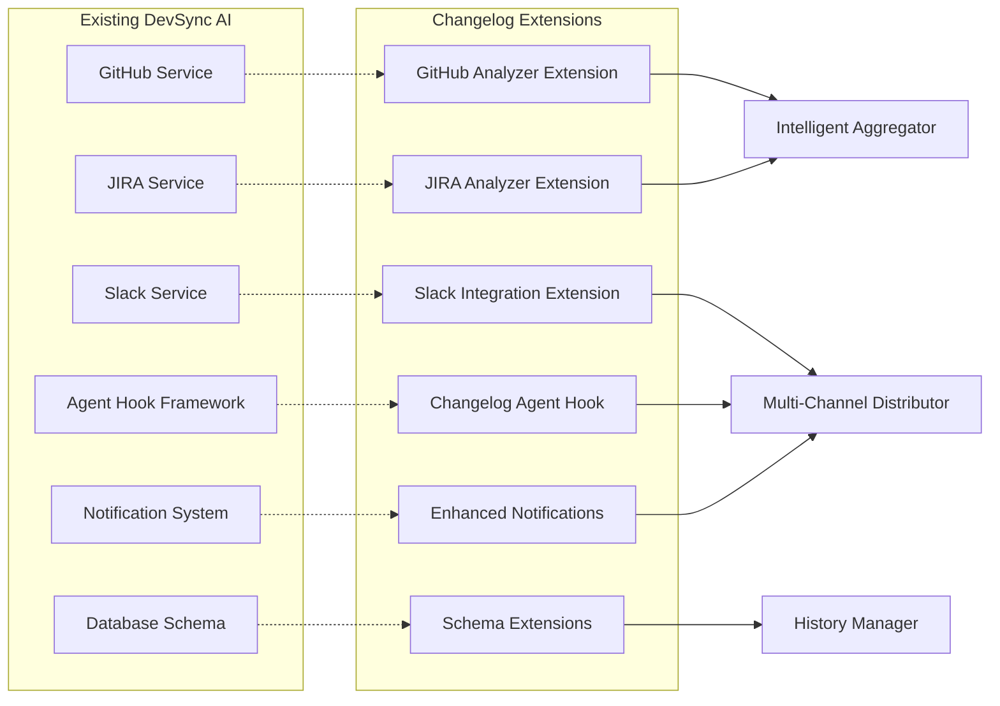
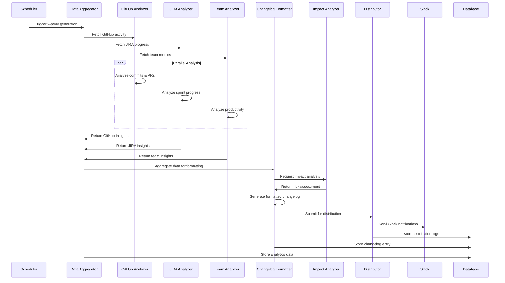

# Professional Weekly Changelog Generation - System Design

## Overview

The Weekly Changelog Generation system is a production-ready, intelligent automation platform that extends DevSync AI's existing infrastructure to deliver comprehensive weekly development summaries. The system leverages advanced data analytics, machine learning-powered content processing, and multi-channel distribution to provide stakeholders with actionable insights into team productivity and project progress.

## Architecture

### High-Level System Architecture



### Component Integration with Existing Infrastructure



## Core Components

### 1. Data Intelligence Layer

#### GitHub Changelog Analyzer
**Purpose**: Extends existing GitHub service with intelligent commit and PR analysis.

**Key Interfaces**:
```python
class GitHubChangelogAnalyzer:
    async def analyze_weekly_activity(self, repo: str, date_range: DateRange) -> GitHubWeeklyData
    async def categorize_commits(self, commits: List[Commit]) -> CategorizedCommits
    async def calculate_pr_impact_score(self, pr: PullRequest) -> ImpactScore
    async def analyze_contributor_activity(self, contributors: List[str]) -> ContributorMetrics
    async def detect_performance_regressions(self, commits: List[Commit]) -> List[RegressionAlert]
```

**Data Models**:
```python
@dataclass
class GitHubWeeklyData:
    commits: CategorizedCommits
    pull_requests: List[EnrichedPullRequest]
    contributors: ContributorMetrics
    repository_health: RepositoryHealthMetrics
    performance_indicators: PerformanceMetrics

@dataclass
class CategorizedCommits:
    features: List[CommitInfo]
    bug_fixes: List[CommitInfo]
    improvements: List[CommitInfo]
    documentation: List[CommitInfo]
    refactoring: List[CommitInfo]
    breaking_changes: List[CommitInfo]
    
@dataclass
class ImpactScore:
    complexity_score: float
    risk_level: RiskLevel
    affected_systems: List[str]
    test_coverage_impact: float
    performance_impact: Optional[PerformanceImpact]
```

#### JIRA Changelog Analyzer
**Purpose**: Extends existing JIRA service with advanced progress tracking and analytics.

**Key Interfaces**:
```python
class JIRAChangelogAnalyzer:
    async def analyze_sprint_progress(self, sprint_id: str) -> SprintAnalytics
    async def calculate_team_velocity(self, team_id: str, weeks: int) -> VelocityMetrics
    async def detect_blockers(self, tickets: List[JiraTicket]) -> List[BlockerAnalysis]
    async def analyze_workload_distribution(self, team_id: str) -> WorkloadAnalysis
    async def predict_completion_dates(self, epic_id: str) -> CompletionForecast
```

**Data Models**:
```python
@dataclass
class SprintAnalytics:
    velocity: VelocityMetrics
    completion_rate: float
    blocker_count: int
    team_capacity_utilization: float
    quality_metrics: QualityMetrics
    
@dataclass
class VelocityMetrics:
    story_points_completed: int
    average_cycle_time: timedelta
    throughput: float
    predictability_score: float
    trend_direction: TrendDirection
    
@dataclass
class BlockerAnalysis:
    ticket_key: str
    blocker_type: BlockerType
    duration: timedelta
    impact_score: float
    suggested_actions: List[str]
```

#### Team Productivity Analyzer
**Purpose**: Analyzes team collaboration patterns and productivity metrics.

**Key Interfaces**:
```python
class TeamProductivityAnalyzer:
    async def analyze_code_review_participation(self, team_id: str) -> ReviewMetrics
    async def calculate_collaboration_score(self, team_id: str) -> CollaborationMetrics
    async def analyze_deployment_frequency(self, team_id: str) -> DeploymentMetrics
    async def detect_productivity_trends(self, team_id: str) -> ProductivityTrends
    async def analyze_meeting_efficiency(self, team_id: str) -> MeetingMetrics
```

### 2. Processing Engine

#### AI-Powered Changelog Formatter
**Purpose**: Intelligent content formatting with ML-based categorization and summarization.

**Key Interfaces**:
```python
class IntelligentChangelogFormatter:
    async def format_changelog(self, data: AggregatedData, template: ChangelogTemplate) -> FormattedChangelog
    async def categorize_changes_ml(self, changes: List[Change]) -> CategorizedChanges
    async def generate_executive_summary(self, data: AggregatedData) -> ExecutiveSummary
    async def detect_breaking_changes(self, changes: List[Change]) -> List[BreakingChange]
    async def optimize_content_for_audience(self, content: str, audience: AudienceType) -> str
```

**Template System**:
```python
@dataclass
class ChangelogTemplate:
    template_id: str
    audience_type: AudienceType
    format_type: FormatType
    sections: List[TemplateSection]
    styling: TemplateStyle
    
@dataclass
class TemplateSection:
    section_id: str
    title: str
    content_type: ContentType
    required: bool
    conditional_logic: Optional[str]
```

#### Contributor Impact Analyzer
**Purpose**: Advanced contributor recognition and impact assessment.

**Key Interfaces**:
```python
class ContributorImpactAnalyzer:
    async def calculate_contribution_score(self, contributor: str, period: DateRange) -> ContributionScore
    async def identify_expertise_areas(self, contributor: str) -> List[ExpertiseArea]
    async def analyze_mentoring_impact(self, contributor: str) -> MentoringMetrics
    async def generate_recognition_recommendations(self, team_id: str) -> List[Recognition]
    async def track_skill_development(self, contributor: str) -> SkillDevelopmentMetrics
```

#### Release Impact Analyzer
**Purpose**: Comprehensive release risk assessment and impact analysis.

**Key Interfaces**:
```python
class ReleaseImpactAnalyzer:
    async def assess_deployment_risk(self, changes: List[Change]) -> RiskAssessment
    async def analyze_performance_impact(self, changes: List[Change]) -> PerformanceImpact
    async def detect_security_implications(self, changes: List[Change]) -> SecurityAnalysis
    async def generate_rollback_plan(self, release: Release) -> RollbackPlan
    async def predict_stakeholder_impact(self, changes: List[Change]) -> StakeholderImpact
```

### 3. Automation & Distribution Layer

#### Intelligent Scheduler
**Purpose**: Advanced scheduling with timezone awareness and intelligent optimization.

**Key Interfaces**:
```python
class IntelligentScheduler:
    async def schedule_changelog_generation(self, team_config: TeamConfig) -> ScheduleResult
    async def optimize_timing_for_team(self, team_id: str) -> OptimalTiming
    async def handle_holiday_adjustments(self, schedule: Schedule) -> AdjustedSchedule
    async def manage_retry_logic(self, failed_job: Job) -> RetryDecision
    async def coordinate_global_teams(self, teams: List[str]) -> GlobalSchedule
```

**Scheduling Models**:
```python
@dataclass
class ScheduleConfig:
    team_id: str
    frequency: ScheduleFrequency
    timezone: str
    preferred_time: time
    holiday_calendar: str
    retry_policy: RetryPolicy
    
@dataclass
class OptimalTiming:
    recommended_time: datetime
    confidence_score: float
    reasoning: str
    alternative_times: List[datetime]
```

#### Multi-Channel Distributor
**Purpose**: Intelligent content distribution across multiple channels with audience optimization.

**Key Interfaces**:
```python
class IntelligentDistributor:
    async def distribute_changelog(self, changelog: FormattedChangelog, config: DistributionConfig) -> DistributionResult
    async def optimize_content_for_channel(self, content: str, channel: ChannelType) -> str
    async def track_engagement_metrics(self, distribution_id: str) -> EngagementMetrics
    async def manage_delivery_confirmation(self, distribution_id: str) -> DeliveryStatus
    async def handle_delivery_failures(self, failed_delivery: FailedDelivery) -> RecoveryAction
```

### 4. Storage & Management Layer

#### Changelog History Manager
**Purpose**: Comprehensive changelog storage, versioning, and analytics.

**Key Interfaces**:
```python
class ChangelogHistoryManager:
    async def store_changelog(self, changelog: FormattedChangelog) -> StorageResult
    async def retrieve_changelog_history(self, filters: HistoryFilters) -> List[ChangelogEntry]
    async def analyze_changelog_trends(self, team_id: str, period: DateRange) -> TrendAnalysis
    async def export_changelog_data(self, export_config: ExportConfig) -> ExportResult
    async def manage_data_retention(self, retention_policy: RetentionPolicy) -> RetentionResult
```

**Storage Schema**:
```sql
-- Changelog entries with full versioning
CREATE TABLE changelog_entries (
    id UUID PRIMARY KEY DEFAULT gen_random_uuid(),
    team_id VARCHAR(100) NOT NULL,
    week_start_date DATE NOT NULL,
    week_end_date DATE NOT NULL,
    version INTEGER NOT NULL DEFAULT 1,
    status changelog_status NOT NULL DEFAULT 'draft',
    content JSONB NOT NULL,
    metadata JSONB,
    generated_at TIMESTAMP DEFAULT NOW(),
    published_at TIMESTAMP,
    created_by VARCHAR(100),
    UNIQUE(team_id, week_start_date, version)
);

-- Distribution tracking
CREATE TABLE changelog_distributions (
    id UUID PRIMARY KEY DEFAULT gen_random_uuid(),
    changelog_id UUID REFERENCES changelog_entries(id),
    channel_type VARCHAR(50) NOT NULL,
    channel_identifier VARCHAR(200) NOT NULL,
    distribution_status VARCHAR(50) NOT NULL,
    delivered_at TIMESTAMP,
    engagement_metrics JSONB,
    error_details TEXT,
    retry_count INTEGER DEFAULT 0
);

-- Analytics and metrics
CREATE TABLE changelog_analytics (
    id UUID PRIMARY KEY DEFAULT gen_random_uuid(),
    changelog_id UUID REFERENCES changelog_entries(id),
    metric_type VARCHAR(100) NOT NULL,
    metric_value DECIMAL NOT NULL,
    metric_metadata JSONB,
    recorded_at TIMESTAMP DEFAULT NOW()
);
```

## Data Flow Architecture

### End-to-End Processing Pipeline



### Data Integration Patterns

#### Service Extension Pattern
```python
# Extending existing GitHub service
class GitHubService:
    # Existing methods remain unchanged
    async def get_pull_requests(self, repo: str) -> List[PullRequest]:
        # Existing implementation
        pass
    
    # New changelog-specific extensions
    async def get_weekly_changelog_data(self, repo: str, week: DateRange) -> GitHubWeeklyData:
        analyzer = GitHubChangelogAnalyzer(self)
        return await analyzer.analyze_weekly_activity(repo, week)
```

#### Configuration Inheritance Pattern
```yaml
# Extends existing team configuration
team_configurations:
  engineering:
    # Existing configuration
    jira:
      project_key: "ENG"
    slack:
      channels: ["#engineering"]
    
    # New changelog configuration
    changelog:
      enabled: true
      schedule:
        day: "friday"
        time: "17:00"
        timezone: "UTC"
      distribution:
        channels: ["#weekly-updates", "#engineering"]
        formats: ["slack", "email"]
      content:
        include_metrics: true
        audience: "technical"
```

## Security Architecture

### Authentication and Authorization

```python
class ChangelogSecurityManager:
    async def validate_team_access(self, user_id: str, team_id: str) -> bool
    async def check_changelog_permissions(self, user_id: str, action: str) -> bool
    async def audit_changelog_access(self, user_id: str, action: str, resource: str) -> None
    async def encrypt_sensitive_data(self, data: Dict[str, Any]) -> EncryptedData
    async def sanitize_external_content(self, content: str) -> str
```

### Data Privacy and Compliance

- **PII Detection**: Automatic detection and redaction of personal information
- **Data Anonymization**: Configurable anonymization for external distribution
- **Audit Trails**: Comprehensive logging of all changelog operations
- **Retention Policies**: Automated data lifecycle management
- **Encryption**: End-to-end encryption for sensitive changelog content

## Performance Architecture

### Scalability Design

#### Horizontal Scaling Strategy
```python
class ChangelogLoadBalancer:
    async def distribute_generation_load(self, teams: List[str]) -> LoadDistribution
    async def manage_resource_allocation(self, current_load: SystemLoad) -> ResourceAllocation
    async def handle_peak_load_scenarios(self, peak_config: PeakLoadConfig) -> ScalingDecision
```

#### Caching Strategy
```python
class ChangelogCacheManager:
    async def cache_github_data(self, repo: str, data: GitHubData, ttl: int) -> None
    async def cache_jira_queries(self, query: str, results: JIRAResults, ttl: int) -> None
    async def invalidate_team_cache(self, team_id: str) -> None
    async def warm_cache_for_scheduled_generation(self, schedule: Schedule) -> None
```

### Performance Monitoring

```python
class ChangelogPerformanceMonitor:
    async def track_generation_time(self, team_id: str, duration: timedelta) -> None
    async def monitor_api_response_times(self, service: str, response_time: float) -> None
    async def detect_performance_degradation(self) -> List[PerformanceAlert]
    async def generate_optimization_recommendations(self) -> List[OptimizationRecommendation]
```

## Error Handling and Recovery

### Comprehensive Error Management

```python
class ChangelogErrorHandler:
    async def handle_data_collection_error(self, error: DataCollectionError) -> RecoveryAction
    async def handle_formatting_error(self, error: FormattingError) -> FallbackAction
    async def handle_distribution_error(self, error: DistributionError) -> RetryDecision
    async def escalate_critical_errors(self, error: CriticalError) -> EscalationAction
```

### Circuit Breaker Implementation

```python
class ChangelogCircuitBreaker:
    async def monitor_service_health(self, service: str) -> HealthStatus
    async def trigger_circuit_breaker(self, service: str, failure_rate: float) -> None
    async def attempt_service_recovery(self, service: str) -> RecoveryResult
    async def fallback_to_cached_data(self, service: str) -> FallbackData
```

## Monitoring and Observability

### Metrics Collection

```python
class ChangelogMetricsCollector:
    async def record_generation_metrics(self, metrics: GenerationMetrics) -> None
    async def record_distribution_metrics(self, metrics: DistributionMetrics) -> None
    async def record_user_engagement_metrics(self, metrics: EngagementMetrics) -> None
    async def generate_health_dashboard_data(self) -> DashboardData
```

### Health Checks and Alerting

- **System Health**: Real-time monitoring of all changelog components
- **Data Quality**: Monitoring of data completeness and accuracy
- **Performance Metrics**: Tracking of generation times and resource usage
- **User Engagement**: Analysis of changelog consumption and feedback
- **Error Rates**: Monitoring of failure rates and recovery times

## Deployment Architecture

### Environment Configuration

```yaml
changelog_system:
  production:
    performance:
      max_concurrent_generations: 20
      cache_ttl_minutes: 30
      api_timeout_seconds: 60
    
    monitoring:
      metrics_retention_days: 90
      alert_thresholds:
        generation_time_minutes: 5
        error_rate_percentage: 5
        api_response_time_seconds: 10
    
    security:
      encryption_enabled: true
      audit_logging: true
      data_retention_days: 365
```

### Database Migration Strategy

```sql
-- Migration versioning and rollback support
CREATE TABLE changelog_schema_migrations (
    version VARCHAR(50) PRIMARY KEY,
    description TEXT NOT NULL,
    applied_at TIMESTAMP DEFAULT NOW(),
    rollback_sql TEXT
);

-- Performance optimization indexes
CREATE INDEX CONCURRENTLY idx_changelog_entries_team_date 
ON changelog_entries(team_id, week_start_date DESC);

CREATE INDEX CONCURRENTLY idx_changelog_distributions_status 
ON changelog_distributions(distribution_status, delivered_at);
```

This comprehensive design provides a robust, scalable, and maintainable foundation for professional-grade weekly changelog generation that seamlessly integrates with the existing DevSync AI infrastructure while delivering advanced automation capabilities.